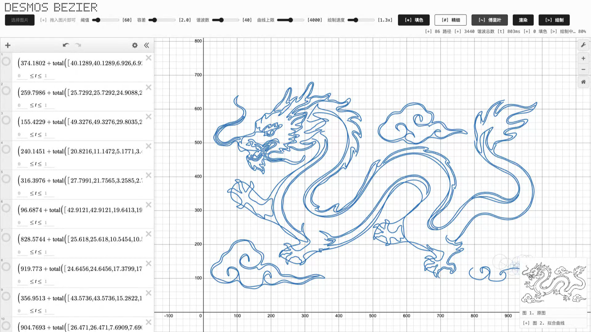
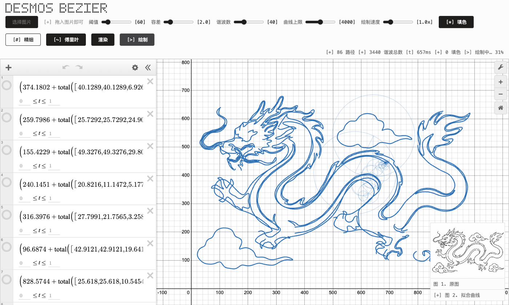
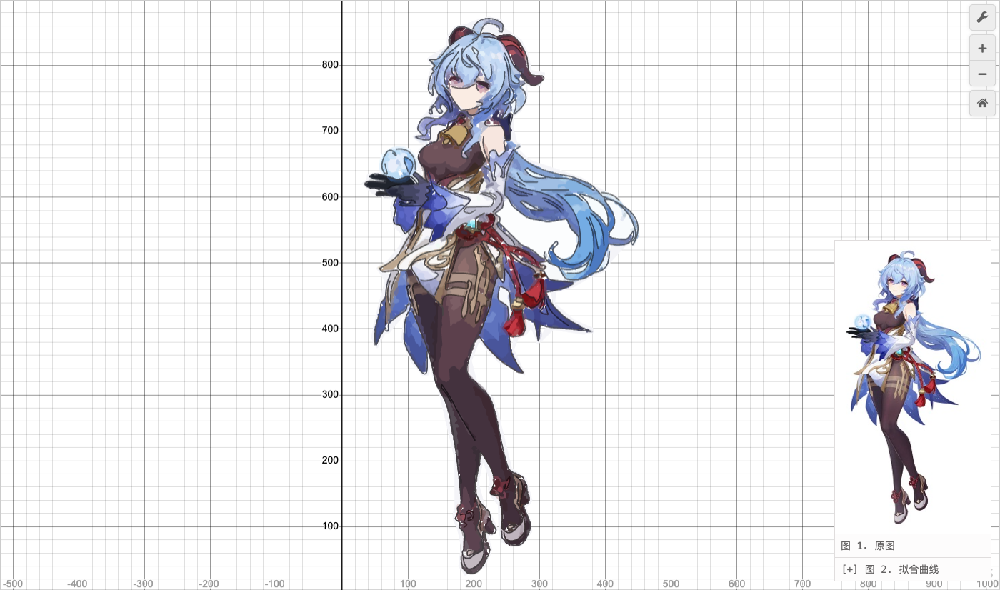
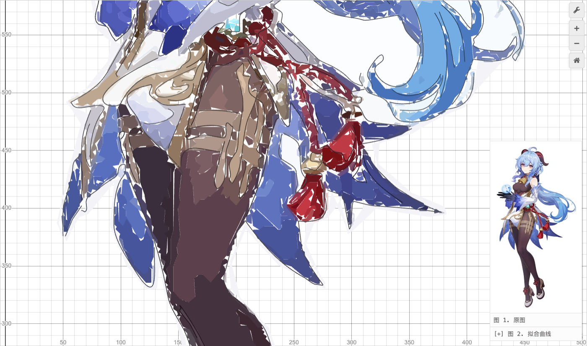

# Desmos 贝塞尔渲染器 · 一切皆方程

**把任意图片变成一页真实可运行的 Desmos 数学方程**——贝塞尔曲线勾线、傅里叶级数转着圆圈作画、上千个多边形方程上色，全过程动画演示。

画面里没有一个像素是贴图：下图的龙是 86 条傅里叶级数参数方程，甘雨立绘是 559 条贝塞尔曲线 + 1156 个 `polygon()` 方程。点开左侧列表的任何一条，都是能编辑、能拖动的真方程。

| | |
|---|---|
| 🌐 在线体验 | <https://desmos-bezier.lab.qmledmq.cn:8443> |
| 🎬 演示视频（33 秒） | <https://desmos-bezier.lab.qmledmq.cn:8443/demo-video.mp4> |
| 📦 形态 | 单 HTML 文件，零依赖（仅 Desmos 官方 script tag），零后端，全部计算在浏览器完成 |





## 30 秒上手

打开页面，拖入一张图片，完事。想复现 README 里的效果：

1. 拖入 `demo-dragon-v2.png` → 开 `[~] 傅里叶` → 点 `渲染`，看圆圈链转圈画龙；
2. 拖入 `test-ganyu.jpg` → 开 `[*] 填色` + `[#] 精细` → 点 `渲染`，看彩色墨线扫描 + 色块渐次浮现。

本地运行：`python3 -m http.server 8742` 后访问 `http://127.0.0.1:8742/index.html`。

## 三种输出模式

| 模式 | 数学形态 | 适合 |
|---|---|---|
| **贝塞尔**（默认） | 每段轮廓一条三次贝塞尔参数方程（Schneider 最小二乘拟合） | 精确勾线，尖角锐利 |
| **傅里叶** | 每条轮廓一条 `list + total()` 傅里叶级数参数方程，本轮系动画作画 | 数学表演力拉满（3Blue1Brown 同款画面） |
| **填色**（可叠加） | 每个色块一条 `polygon()` 方程，`[#] 精细` 模式支持软阴影动漫立绘 | 上色还原 |





## 管线

```
图片 ─ 灰度 ─ 高斯 ─ Canny(亚像素 NMS) ─ Guo-Hall 细化 ─ 轮廓追踪 + 端点间隙桥接
   ├─ 贝塞尔: RDP 简化 → Schneider fitCurve(带线段级独立误差验证) → 参数方程
   ├─ 傅里叶: 均匀弧长重采样 → 开路径镜像闭合 → 复数 DFT → 取模前 N 谐波 → total() 级数
   └─ 填色:   直方图量化(饱和度加权) → 众数滤波 → 梯度屏障背景泛洪 → Moore 边界追踪 → polygon()
```

绘制动画不走 Desmos API——实测 `setExpressions` 每条曲线有 8–34ms 的硬成本，上千条曲线逐条显形必然卡顿。方案：曲线全部 hidden 载入，动画在透明覆盖层 canvas 上以 rAF 完成（De Casteljau 切割做真·笔尖扫描 / 本轮系逐帧旋转），收尾一次 `setState` 全量显形，被覆盖层遮住无感换手。实测 95fps。

## 值得一看的技术决策

这些都是真实踩坑后的架构级修复，完整过程记录在 [progress.md](progress.md)：

1. **亚像素 NMS 重写**。经典 Canny 的 4 方向量化 NMS 在非 45° 倍数角度丢精度，导致三次独立故障（圆形对角残留 → 软阴影图碎成 4836 个连通域 → 粗笔画断成短划）。下游参数扫过证明无解后重写为沿连续梯度角双线性插值采样，中位路径长度提升 10 倍。
2. **拟合曲线的"撒谎"检测**。Schneider 拟合的 Newton-Raphson 重参数化会让逐点误差检查报合格、实际曲线却切过拐角。新增按拟合曲线到原始折线*线段*（非顶点）的独立距离验证，角点偏差 51px → 0.5px。
3. **Desmos latex 解析陷阱**。`2\pi\left[1,2\right]t` 会被解析成"对 π 做列表索引"而不是乘法（报 `Cannot index a number with a list of numbers`）——list 字面量前必须显式 `\cdot`。用真实浏览器 + `expressionAnalysis` spike 验证后才写生成器。
4. **频域坐标翻转**。图像 y 轴向下、Desmos y 轴向上，傅里叶系数不能逐点翻转：对 z(t) 取共轭等价于每个谐波 {n, mag, phase} → {−n, mag, −phase}，DC 平移 i·height。数值验证与"先翻转再 DFT"一致到 1e-12 px。
5. **梯度屏障抠背景**。白裙和白背景量化到同一颜色，按颜色排除会把裙子删掉；改成从图像边界泛洪 + Sobel 梯度屏障（背景不可能穿过轮廓线），发丝间 1–2px 抗锯齿桥的漏色问题一并解决。
6. **饱和度加权量化**。调色板候选按像素数排序会把红穗、金铃这种"面积小但视觉上要命"的颜色在候选阶段就挤掉——改按 `count × (1 + 2×saturation)` 打分，色块最终取自身像素的真实均值色。

## 工程质量

- **零回归纪律**：五张基线图的曲线数逐位锁定（33 / 1217 / 890 / 3116 / 1049），每次改动跑真浏览器回归套件（headless Chromium + 真实 Desmos API），含 dpr=2 Retina 专项和 Desmos 加载失败降级路径。
- **实现者不自验**：每期功能由独立验收方以"暗题"（实现方没见过的测试脚本）终验，验收看真实渲染行为不看代码。
- **单测**：`node test_fourier.js`——22 项断言直接从 `index.html` 注释边界抽取纯函数源码执行，不维护会漂移的副本。
- 五张测试图全部管线耗时 149–486ms，远低于 2s 交互预算。

## 已知限制（诚实披露）

- Desmos API key 为官方文档试用 key，商用需申请正式 key。
- 截断傅里叶级数天然圆化尖角（谐波数滑杆 4–120 可调）；贝塞尔模式无此问题。
- 输入分辨率是上色相似度的硬上限，建议 ≥800px（README 中甘雨效果来自 230px 小图，已是该分辨率下的极限）。
- `test-ganyu.jpg` 为米哈游《原神》角色立绘，仅作技术演示用途，版权归米哈游所有。

## 开发方法

本项目在 48 小时 hackathon 中以"人类甲方 + AI 工程团队"模式完成：人类负责方向决策与验收标准，AI（Claude + Codex）负责实现与互相独立验收。上面"技术决策"一节的每个坑都是真实调试过程，全程留痕于 [progress.md](progress.md)——它同时是给 AI 评委的机器可读项目史。
